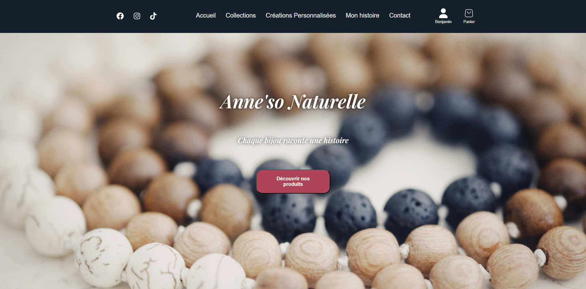
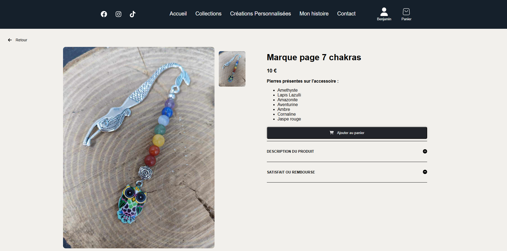

# Anne'so Naturelle - Boutique en ligne de produits bien-être 💎

## 🌿 Présentation
Anne'so Naturelle est un site e-commerce dédié à la vente de bijoux en pierres naturelles, de produits de bien-être et d'articles pour créer une ambiance zen. 

👉 [Visiter le site](https://anneso-naturelle.fr)

## 🛍️ Fonctionnalités principales
- **Catalogue de produits** : Bracelets, boucles d'oreilles, lampes de sel, diffuseurs et plus encore.
- **Créations de compte** : Création d'un compte utilisateur pour suivre ses produits favoris, ses commandes et mettre à jour ses informations.
- **Gestion des commandes** : Parcours d'achat fluide avec panier et validation de commande.
- **Système de paiement sécurisé** : Intégré pour une expérience utilisateur optimale.
- **Informations et conseils** : Articles de blog pour mieux comprendre les vertus des pierres naturelles.

## 🔧 Technologies utilisées
- **Front-end** : React.js + SCSS
- **Back-end** : Node.js + Express.js + MongoDB
- **Hébergement** : Vercel
- **Outils** : Stripe

## 📸 Aperçu du site

## 🚀 Objectifs du projet
- Créer une plateforme esthétique et intuitive pour présenter les produits.
- Offrir une expérience utilisateur agréable pour encourager l'achat.
- Sensibiliser sur les bienfaits des pierres naturelles et du bien-être.

## 📫 Contact
Si vous souhaitez en savoir plus ou échanger sur ce projet, n'hésitez pas à me contacter via GitHub !
